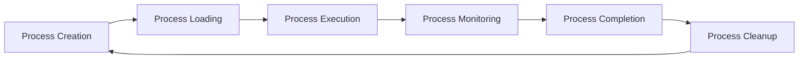
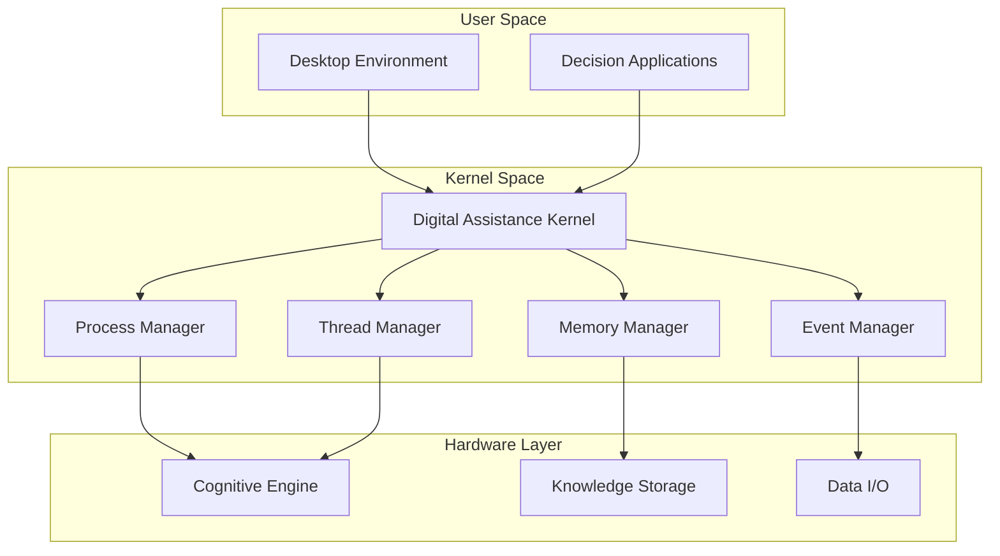
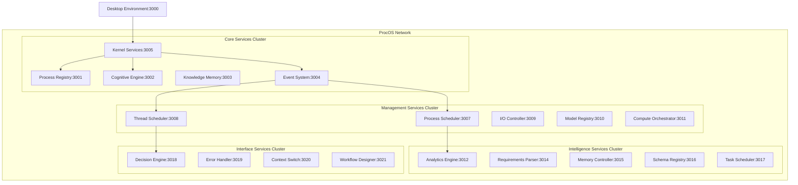

# DADMS to ProcOS.ai Architecture Mapping

This document preserves the DADMS architecture knowledge while translating it into ProcOS.ai process-oriented concepts.

## 🏗️ Service Architecture Mapping

### Core Services Translation

| DADMS Service | Port | ProcOS Service | Process-OS Role | Description |
|---------------|------|----------------|-----------------|-------------|
| **Project Service** | 3001 | **Process Registry** | Process Table | Manages decision processes and their lifecycle |
| **LLM Service** | 3002 | **Cognitive Engine** | CPU Cores | Provides computational intelligence for decisions |
| **Knowledge Service** | 3003 | **Knowledge Memory** | RAM/Storage | Manages document storage and retrieval |
| **Event Manager** | 3004 | **Event System** | Interrupt Controller | Central nervous system for event-driven intelligence |
| **DAS (Digital Assistance)** | 3005 | **Kernel Services** | OS Kernel | The intelligent medium that permeates everything |
| **LLM Playground** | 3006 | **Development Console** | Debug Interface | Interactive testing environment |
| **Process Manager** | 3007 | **Process Scheduler** | Process Manager | BPMN execution and orchestration |
| **Thread Manager** | 3008 | **Thread Scheduler** | Thread Manager | Process thread tracking and feedback |
| **Data Manager** | 3009 | **I/O Controller** | Device Manager | External data gateway and streaming |
| **Model Manager** | 3010 | **Model Registry** | Driver Registry | Computational model management |
| **Simulation Manager** | 3011 | **Compute Orchestrator** | Job Scheduler | Simulation execution across resources |
| **Analysis Manager** | 3012 | **Analytics Engine** | Performance Monitor | Intelligent evaluation and insights |
| **Parameter Manager** | 3013 | **Config Manager** | System Settings | Parameter and configuration management |
| **Requirements Extractor** | 3014 | **Requirements Parser** | System Analyzer | Automated requirement extraction |
| **Memory Manager** | 3015 | **Memory Controller** | Memory Manager | Persistent knowledge management |
| **Ontology Workspace** | 3016 | **Schema Registry** | File System | Knowledge structure management |
| **Task Orchestrator** | 3017 | **Task Scheduler** | Cron/Scheduler | Automated task coordination |
| **Decision Analytics** | 3018 | **Decision Engine** | Decision Support | Core decision intelligence |
| **Error Manager** | 3019 | **Error Handler** | Exception Handler | System-wide error management |
| **Context Manager** | 3020 | **Context Switch** | Context Manager | AI personas and teams management |
| **BPMN Workspace** | 3021 | **Workflow Designer** | Process Editor | Visual workflow design environment |

### Infrastructure Services

| Component | DADMS | ProcOS | Role |
|-----------|-------|--------|------|
| **Database** | PostgreSQL (5432) | **Primary Storage** | File System |
| **Graph DB** | Neo4j (7474/7687) | **Relationship Graph** | Directory Structure |
| **Memory DB** | Neo4j Memory (7475/7688) | **Cache Memory** | RAM Cache |
| **Message Queue** | Redis (6379) | **IPC System** | Inter-Process Communication |
| **Vector DB** | Qdrant (6333) | **Semantic Index** | Search Index |
| **UI** | React (3000) | **Desktop Environment** | User Interface |

## 🔄 Process-OS Conceptual Framework

### Process Lifecycle

### System Architecture

## 🧠 Digital Assistance System (DAS) Evolution

### DADMS DAS Concept
- Intelligent medium that permeates every aspect
- Co-creates workflows through ambient intelligence
- Learns from every interaction
- Maintains total context awareness

### ProcOS DAS as Kernel
- **Process Scheduling**: Intelligent decision process prioritization
- **Memory Management**: Context-aware knowledge allocation  
- **Resource Management**: Computational resource optimization
- **Security**: Governance and compliance enforcement
- **I/O Management**: Human-AI collaboration orchestration

## 🌐 Network Architecture

### Service Mesh Communication

## 📊 Performance Characteristics

### DADMS Performance Metrics (Preserved)
- **Project Creation**: < 30 seconds
- **Document Search**: < 5 seconds  
- **Process Execution**: Real-time monitoring
- **Event Processing**: WebSocket streaming
- **Knowledge Retrieval**: Vector search optimization

### ProcOS Performance Targets
- **Process Spawn Time**: < 1 second
- **Thread Context Switch**: < 100ms
- **Memory Access**: < 10ms for cached knowledge
- **I/O Operations**: Streaming with < 500ms latency
- **Decision Latency**: < 2 seconds for complex decisions

## 🔄 Migration Strategy

### Phase 1: Foundation (Current)
- Repository setup ✅
- Architecture documentation ✅
- Conceptual framework mapping ✅

### Phase 2: Website Development
- Next.js website with Process-OS concepts
- Interactive demonstrations
- Documentation portal

### Phase 3: Platform Migration
- Gradual service rebranding from DADMS to ProcOS
- Process-OS interface development
- Performance optimization

### Phase 4: Advanced Features
- Full Process-OS desktop environment
- Marketplace for decision processes
- Community collaboration features

This mapping preserves all DADMS architectural knowledge while providing a clear evolution path to the ProcOS.ai process-oriented paradigm.